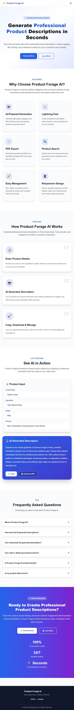
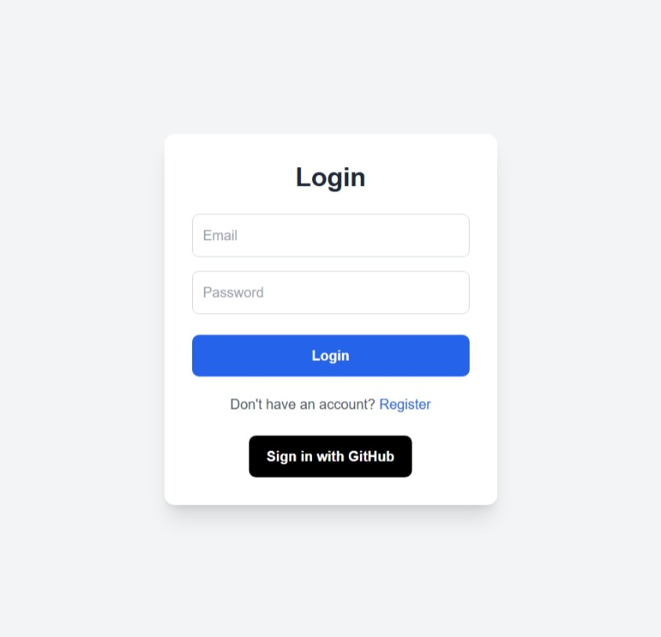
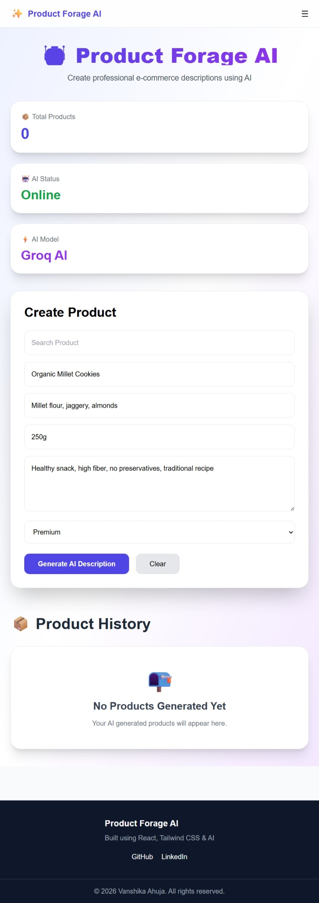
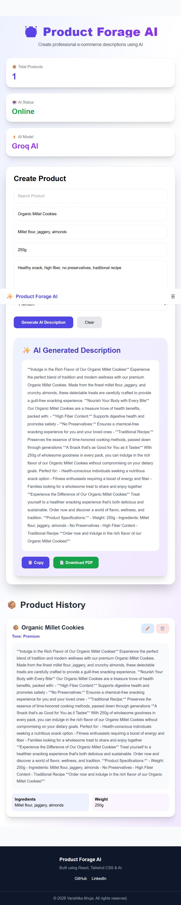
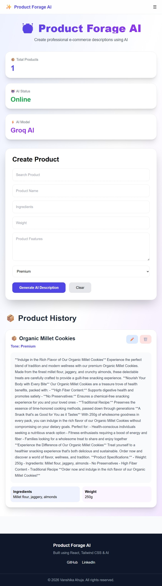

# Product-Forage-AI

AI-powered product description generator for e-commerce sellers.

## Live Demo

https://product-forage-w3ecanzie-vanshika22.vercel.app/

## Screenshots

### Home Page

### Login Page

### Register Page

### AI Description Generator

### Input

### AI Description 

### Dashboard

## Features

- AI product description generation
- Multiple writing tones
- User authentication
- Product CRUD operations
- MongoDB data storage
- Responsive React UI
- Cloud deployment

## Tech Stack

Frontend:
- React.js
- Tailwind CSS

Backend:
- Node.js
- Express.js

Database:
- MongoDB Atlas

AI:
- Groq API

Deployment:
- Vercel
- Render

## Setup Instructions

### Clone Repository

git clone <repo-url>

### Frontend

cd frontend

npm install

npm run dev

### Backend

cd backend

npm install

npm start

## Environment Variables

Frontend:

REACT_API_URL

Backend:

MONGO_URI

JWT_SECRET

GROQ_API_KEY

CLIENT_URL

## API Documentation

### Generate Description

POST

/api/generate-description

Request:

{
"name":"Organic Cookies",
"tone":"Premium"
}

Response:

{
"description":"AI generated text"
}

## Folder Structure

Product-Forage-AI

├── frontend

├── backend

│   ├── routes

│   ├── models

│   └── server.js

## Known Limitations

- Free Render instances may sleep after inactivity.
- AI generation depends on API availability.
- Limited customization options.

## Credits

Built during TBI-GEU Summer Internship Program 2026.

AI assistance:
- Groq API
- ChatGPT
